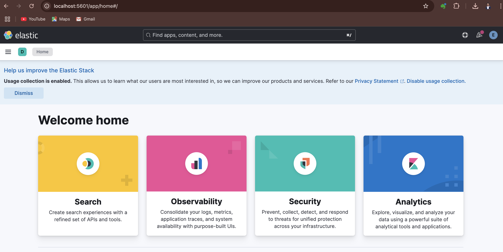

# ELK Stack Setup with Docker Compose

This project sets up the **ELK Stack** (Elasticsearch, Logstash, and Kibana) using Docker Compose for a fully functional logging and monitoring solution. The setup also includes secure communication between services using SSL certificates and configurations for data pipelines in Logstash.

## Project Structure

- **Docker Compose**: The `docker-compose.yml` file defines the services for Elasticsearch, Kibana, Logstash, and other components.
- **SSL Certificates**: Certificates are generated for secure communication between services.
- **Logstash Pipeline**: The configuration for Logstash to process log files and send them to Elasticsearch.

## Components

### 1. **Elasticsearch**
Elasticsearch is a distributed search and analytics engine. This setup includes a 3-node Elasticsearch cluster with SSL security enabled.

#### Key Configurations:
- **SSL Encryption**: The communication between Elasticsearch nodes is encrypted using certificates.
- **Security**: The setup uses the `xpack.security` feature to enable authentication and authorization for Elasticsearch.

#### Environment Variables:
- `ELASTIC_PASSWORD`: Password for the `elastic` user.
- `KIBANA_PASSWORD`: Password for the `kibana_system` user.
- `CLUSTER_NAME`: Name of the Elasticsearch cluster.
- `LICENSE`: Type of the Elasticsearch license (e.g., `trial`).

### 2. **Kibana**
Kibana provides a web interface for visualizing the data in Elasticsearch. The service is configured to connect securely to Elasticsearch.

#### Key Configurations:
- **Security**: Uses `kibana_system` credentials to connect to Elasticsearch.
- **SSL**: The connection between Kibana and Elasticsearch is encrypted using the generated certificates.

### 3. **Logstash**
Logstash processes log data and sends it to Elasticsearch for storage and analysis. The Logstash pipeline is configured to read logs from CSV files and process them.

#### Key Configurations:
- **Input Configuration**: Reads log files (e.g., `customers-1000.csv`, `people-1000.csv`) from the Logstash pipeline directory.
- **Filters**: Data transformations and parsing can be configured to meet specific needs.
- **Output**: The processed data is sent to Elasticsearch.

#### Logstash Configuration (`logstash.conf`):
```plaintext
input {
  file {
    path => "/usr/share/logstash/pipeline/customers-1000.csv"
    start_position => "beginning"
    sincedb_path => "/dev/null"
    codec => plain {
      charset => "UTF-8"
    }
  }
  file {
    path => "/usr/share/logstash/pipeline/people-1000.csv"
    start_position => "beginning"
    sincedb_path => "/dev/null"
    codec => plain {
      charset => "UTF-8"
    }
  }
}

filter {
  csv {
    separator => ","
    skip_header => "true"
    columns => [
      "Index", "User Id", "First Name", "Last Name", "Company", "City", "Country", 
      "Subscription Date", "Website"
    ]
    add_field => { "source" => "customers" }
  }
  
  if [source] == "customers" {
    mutate {
      convert => { "Index" => "integer" }
    }
    
    # Ensure the 'Subscription Date' field is parsed into a date format
    date {
      match => ["Subscription Date", "dd/MM/yyyy"]
      target => "Subscription Date"
      tag_on_failure => ["date_parse_failure"]
    }
  }

  csv {
    separator => ","
    skip_header => "true"
    columns => [
      "Index", "User Id", "First Name", "Last Name", "Sex", "Email", "Phone", 
      "Date of birth", "Job Title"
    ]
    add_field => { "source" => "people" }
  }
  
  if [source] == "people" {
    mutate {
      convert => { "Index" => "integer" }
    }
    
    # Ensure the 'Date of birth' field is parsed into a date format
    date {
      match => ["Date of birth", "dd/MM/yyyy"]
      target => "Date of birth"
      tag_on_failure => ["date_parse_failure"]
    }

    
  }

  # Enrichment: Join customers and people data
  aggregate {
    task_id => "%{[User Id]}"
    code => "
      map['User Id'] = event.get('User Id')
      map['First Name'] ||= event.get('First Name')
      map['Last Name'] ||= event.get('Last Name')
      map['Company'] ||= event.get('Company')
      map['City'] ||= event.get('City')
      map['Country'] ||= event.get('Country')
      map['Subscription Date'] ||= event.get('Subscription Date')
      map['Website'] ||= event.get('Website')
      map['Sex'] ||= event.get('Sex')
      map['Email'] ||= event.get('Email')
      map['Phone'] ||= event.get('Phone')
      map['Date of birth'] ||= event.get('Date of birth')
      map['Job Title'] ||= event.get('Job Title')
      event.cancel()
    "
    push_previous_map_as_event => true
    timeout => 3
  }

  # Enrichment: Calculate Age
  ruby {
    code => "
      require 'date'
      if event.get('Date of birth')
        dob = Date.parse(event.get('Date of birth'))
        today = Date.today
        age = today.year - dob.year - ((today.month > dob.month || (today.month == dob.month && today.day >= dob.day)) ? 0 : 1)
        event.set('Age', age)
      end
    "
  }
}

output {
  elasticsearch {
    hosts => ["https://es01:9200"]
    index => "enriched_users"
    user => "${ELASTIC_USERNAME}"
    password => "${ELASTIC_PASSWORD}"
    ssl_enabled => true
    ssl_certificate_verification => true
    cacert => "/usr/share/logstash/config/certs/ca/ca.crt"
    timeout => "${ELASTIC_TIMEOUT}"
  }

  stdout { codec => rubydebug }
}


## **Kinbana UI**
